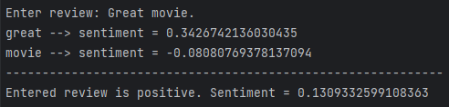
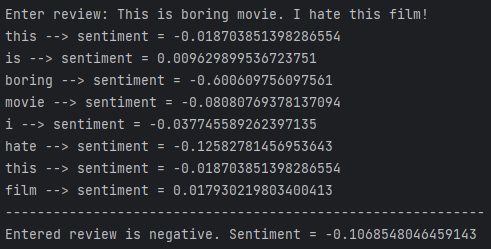

# Sentiment Analyser
> This Python program is helpful in analyzing movie reviews because it can automatically determine the sentiment 
> of new comments and reviews based on its database of 25 000 short movie reviews previously rated as positive
> and negative.


## Table of Contents
* [General Info](#general-information)
* [Technologies Used](#technologies-used)
* [Features](#features)
* [Screenshots](#screenshots)
* [Setup](#setup)
* [Usage](#usage)
* [Room for Improvement](#room-for-improvement)
* [Acknowledgements](#acknowledgements)


## General Information
The purpose of the program is to use a _glob_ module from standard Python's library and to analyze a dataset 
of movie reviews. The training reference data consists of 12 500 positive and 12 500 negative film reviews.

The program compute how many positive reviews and how many negative reviews from the database each word 
of the user's review appears in and finally calculates the total user's review sentiment.

Thanks to this project, I learned how to use Python programing language and its packages to analyze data.


## Technologies Used
- [Python](https://www.python.org/) - version 3.11.3
- from Python's standard library:
  - [_glob_](https://docs.python.org/3/library/glob.html) module


## Features
- The user enters his film review and receives its general sentiment.

## Screenshots
Example with positive comment:



Example with negative comment:



## Setup
I assume You know how to cloning this repository. If not, I refer you to 
[this publication](https://docs.github.com/en/repositories/creating-and-managing-repositories/cloning-a-repository)

Python version should not matter here, although the program was written and tested on version 3.11.3. 
There is no need to install anything extra.

You can check your Python version by typing in terminal:
```bash
python --version
```


## Usage
How does one go about using it? It's simple. :-) Type in terminal:\
```bash
python sentiment-analyser.py
```


## Room for Improvement
Room for improvement:
- Improving word counts in reference data
- Improving review sentiment analysis
- Code refactor

To do:
- Using _click_ module
- Tests using _PyTest_


## Acknowledgements
- This program was inspired by one of exercises of
[the Practical Python](https://praktycznypython.pl/) educational program
- Many thanks to [Krzysztof Mędrela](https://medrela.com/)
